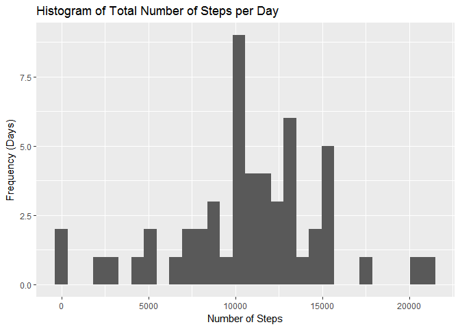
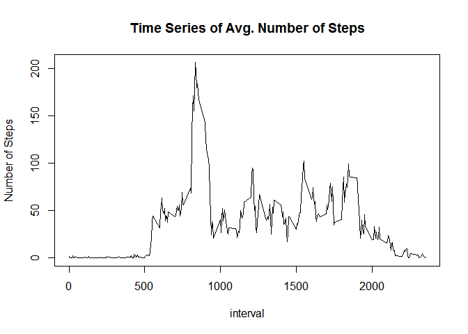
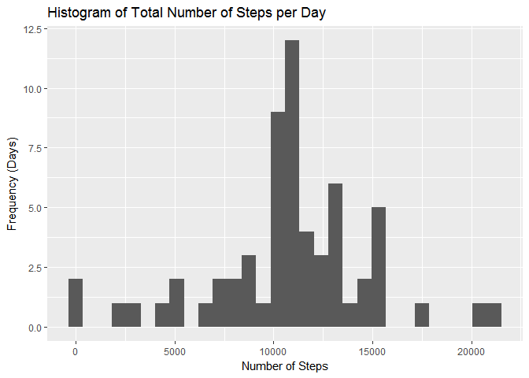
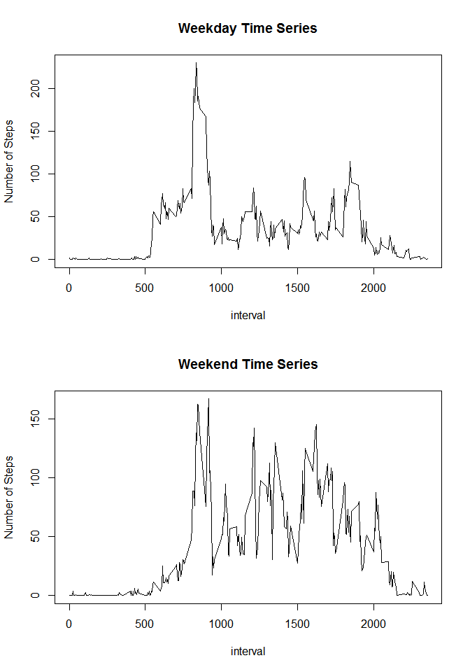

# Reproducible Research: Peer Assessment 1


  
This is the final project of Reproducible Research course. An analysis is done on [Activity monitoring data](https://d396qusza40orc.cloudfront.net/repdata%2Fdata%2Factivity.zip). The objective is to find the pattern of number of steps throughout the day (in 5-minute intervals.)  

The data is first analyzed while ignoring missing values. Then, the next step is to impute values and repeat the analysis. The pattern is also analyzed and compared between weekday and weekend.  
  
## Loading and preprocessing the data
The first step is to load data from the working directory and convert the data into appropreate classes.  

```r
activity <- read.csv("activity.csv", colClasses = c("numeric", "Date", "numeric"))
```
  
## What is mean total number of steps taken per day?
Next, the total number of steps for each day is computed. Then, the histogram is plotted to see the frequencies of number of steps.


```r
options(digits = 2)
library(ggplot2)
sumsteps <- with(activity, tapply(steps, date, sum))
qplot(sumsteps) + labs(x = "Number of Steps", y = "Frequency (Days)", title = "Histogram of Total Number of Steps per Day")
```

<!-- -->

```r
meanst <- mean(sumsteps, na.rm = TRUE)
medianst <- median(sumsteps, na.rm = TRUE)
```

The mean of total steps per day is 10766.19. The median is 10765. Note that the missing value is ignored in this case.  

## What is the average daily activity pattern?
Mean value is calculated for each interval, then plotted as time series.

```r
meansteps <- with(activity, tapply(steps, interval, mean, na.rm = TRUE))
pattern <- data.frame(interval = names(meansteps), steps = meansteps, stringsAsFactors = FALSE)
with(pattern, plot(interval, steps, type = "l", ylab = "Number of Steps", main = "Time Series of Avg. Number of Steps"))
```

<!-- -->
  
## Imputing missing values
The missing values are then imputed by using the mean value of that 5-minute interval. The new data is used to do similar analysis above and the results are compared. First of all, the histogram is plotted. The shape of the new histogram changed, since the day with missing values are now imputed with the same one value - the mean of total steps per day, which is 10766.19. This is why there is one bin that has significantly increased value.


```r
nanum <- sum(is.na(activity))

##impute data
activity.im <- activity
for (i in 1:nrow(activity.im)) {
    if (is.na(activity.im$steps[i])){
        activity.im$steps[i] <- meansteps[as.character(activity.im$interval[i])]
    }
}

sumsteps.im <- with(activity.im, tapply(steps, date, sum, na.rm = TRUE))
qplot(sumsteps.im) + labs(x = "Number of Steps", y = "Frequency (Days)", title = "Histogram of Total Number of Steps per Day")
```

<!-- -->

```r
meanst.im <- mean(sumsteps.im, na.rm = TRUE)
medianst.im <- median(sumsteps.im, na.rm = TRUE)
```
Previously in the activity data, the number of rows in with NAs is 2304.  

After imputing data, the mean of total steps per day is 10766.19. The median is 10766.19. The median and mean is now the same.  

## Are there differences in activity patterns between weekdays and weekends?
Lastly, the data is split into weekday and weekend. The time series are then plotted. The weekday plot is similar to the overall plot in the previous section. However, the weekend plot has different shape as numer of steps is higher from around interval 1000 through 2000. This can be due to during weekday, the test subject maybe less active.


```r
weekend <- c("Saturday", "Sunday")

for (i in 1:nrow(activity.im)) {
    if (weekdays(activity.im$date[i]) %in% weekend){
        activity.im$day[i] <- "weekend"
    }
    else activity.im$day[i] <- "weekday"
}

meansteps.wkday <- with(subset(activity.im, day == "weekday"), tapply(steps, interval, mean, na.rm = TRUE))
meansteps.wkend <- with(subset(activity.im, day == "weekend"), tapply(steps, interval, mean, na.rm = TRUE))

pattern.wkday <- data.frame(interval = names(meansteps.wkday), steps = meansteps.wkday, stringsAsFactors = FALSE)
pattern.wkend <- data.frame(interval = names(meansteps.wkend), steps = meansteps.wkend, stringsAsFactors = FALSE)


par(mfrow = c(2,1))
with(pattern.wkday, plot(interval, steps, type = "l", ylab = "Number of Steps", main = "Weekday Time Series"))
with(pattern.wkend, plot(interval, steps, type = "l", ylab = "Number of Steps", main = "Weekend Time Series"))
```

<!-- -->

